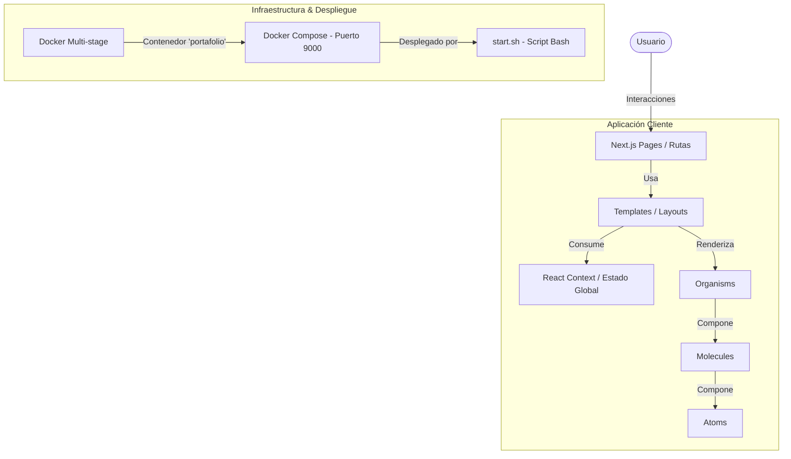

# Arquitectura del Sistema (ARCHITECTURE.md)

Este documento detalla la arquitectura de software, el flujo de datos, la estructura de directorios y el ciclo de vida de despliegue del portafolio digital de **Jesus Ali**.

---

## 🗺️ Vista General de la Arquitectura
La aplicación está diseñada bajo el patrón de **Single Page Application (SPA)** implementada con **Next.js (Page Router)** en el frontend. Su enfoque principal es la modularidad y el rendimiento, utilizando una estructura limpia y desacoplada.

---

## 📂 Estructura de Directorios
La estructura del proyecto sigue un orden jerárquico claro, separando las responsabilidades de enrutamiento, lógica de negocio/estado, estilos y componentes visuales:

*   **`pages/`**: Define los puntos de entrada y rutas de la aplicación.
    *   `_app.tsx`: Inicializa la aplicación, inyecta el proveedor de estado global (`State.tsx`) y aplica los estilos globales.
    *   `index.tsx`: Página de inicio (renderiza `MeTemplate`).
    *   `about.tsx`: Página sobre el autor (renderiza `AboutTemplate`).
    *   `contact.tsx`: Página de contacto (renderiza `ContactTemplate`).
*   **`components/`**: Aloja los elementos de la interfaz de usuario bajo la convención de **Atomic Design**:
    *   `atoms/`: Componentes gráficos indivisibles y reutilizables (ej. iconos, enlaces, divisores).
    *   `molecules/`: Componentes con lógica y estado simple (ej. menú, títulos con animaciones, pantalla de código simulado).
    *   `organisms/`: Secciones de página de alto nivel que integran múltiples moléculas y átomos.
    *   `templates/`: Layouts estructurales que encapsulan organismos y configuran el SEO mediante `<Head>` de Next.js.
    *   `index.tsx`: Punto de exportación único para todos los componentes para simplificar las importaciones.
*   **`context/`**: Contiene la lógica del estado de navegación global.
    *   `Context.tsx`: Creación del contexto de React.
    *   `Reducer.tsx`: Manejador de transiciones del estado.
    *   `State.tsx`: Componente proveedor que expone las propiedades del estado y los métodos de actualización.
*   **`styles/`**:
    *   `globals.css`: Punto de entrada de estilos. Integra las directivas de Tailwind CSS, personalizaciones globales y animaciones complejas utilizadas en la app (como las transiciones y animaciones de código simulado).
*   **`public/`**: Contiene recursos estáticos e iconos SVG estructurados.

---

## 🔄 Flujo de Navegación y Datos
La aplicación simula transiciones suaves entre páginas utilizando el estado global de navegación en lugar de recargas de página tradicionales:

1.  **Cambio de Sección**: Cuando un usuario interactúa con un enlace en `SideMenu` o `Header`, se llama a la función `setSection` expuesta por el contexto global.
2.  **Transición de Componentes**: El estado cambia en `context/State.tsx` (despachando la acción `SET_SECTION` al `Reducer.tsx`).
3.  **Actualización de Vista**: Los componentes reaccionan al cambio de estado de la sección activa, activando transiciones animadas gestionadas con `react-transition-group` o CSS para renderizar el contenido seleccionado.

---

## 🐳 Flujo de Construcción y Contenedores
El despliegue y distribución del proyecto está dockerizado para asegurar portabilidad y consistencia en producción:

1.  **Dockerfile (Compilación Multi-etapa)**:
    *   **Etapa 1 (`deps`)**: Descarga e instala las dependencias de desarrollo y producción de Node.js de manera óptima utilizando `yarn install --frozen-lockfile`.
    *   **Etapa 2 (`builder`)**: Copia el código fuente del proyecto, utiliza las dependencias de la etapa anterior, ejecuta `yarn build` para compilar la aplicación estática/SSR de Next.js, y luego limpia dependencias no necesarias para producción (`yarn install --production --ignore-scripts --prefer-offline`).
    *   **Etapa 3 (`runner`)**: Configura el entorno de producción (`NODE_ENV production`), crea un usuario no root (`nextjs`) por motivos de seguridad, copia los archivos estrictamente necesarios de las etapas previas y arranca el servidor a través de `yarn start` exponiendo el puerto `3000`.
2.  **Docker Compose**:
    *   Configura el contenedor bajo el nombre `portafolio`.
    *   Mapea el puerto de escucha interno `3000` del contenedor al puerto externo **`9000`** en el host.
3.  **Despliegue Continuo (`start.sh`)**:
    *   Realiza un `git pull` para obtener los últimos cambios de la rama correspondiente.
    *   Apaga, remueve los contenedores y elimina las imágenes previas para liberar espacio.
    *   Reconstruye y levanta el servicio en segundo plano con `docker-compose up --build -d`.
    *   Ejecuta `docker system prune` para limpiar imágenes huérfanas y cachés inactivas.
