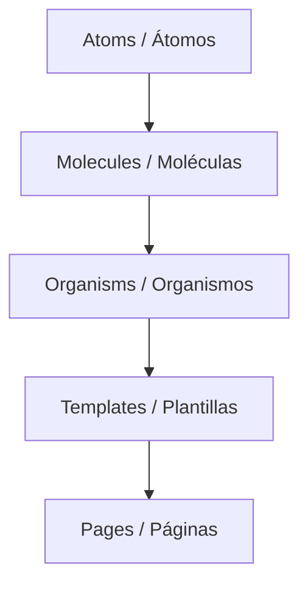

# Contexto de Producto - Portafolio de Jesus Ali

Este documento define el propósito, las características clave y la arquitectura del portafolio digital de **Jesus Ali**, diseñado como una aplicación web interactiva y moderna.

## 🎯 Propósito del Producto
El portafolio tiene como objetivo presentar la trayectoria profesional, habilidades y experiencia de Jesus Ali, Ingeniero en Tecnologías de Información con más de 6 años de experiencia en desarrollo Frontend. Sirve como carta de presentación interactiva para reclutadores, clientes y colaboradores.

---

## 🛠️ Tecnologías Principales (Tech Stack)
La aplicación está construida sobre una arquitectura robusta y moderna:
- **Framework principal**: [Next.js](https://nextjs.org/) (v13.3, Page Router) con React (v18.2).
- **Lenguaje**: [TypeScript](https://www.typescriptlang.org/) para garantizar tipado estático y robustez del código.
- **Estilos**: [Tailwind CSS](https://tailwindcss.com/) (v3.3) junto con PostCSS para un diseño responsive y modular.
- **Animaciones**: [React Transition Group](https://reactcommunity.org/react-transition-group/) para manejar transiciones suaves de componentes.
- **Herramientas de desarrollo**: Configuración de ESLint para el formateo de código, Docker y Docker Compose para empaquetado de producción.

---

## 🏗️ Arquitectura de Diseño de UI (Atomic Design)
El proyecto implementa la metodología de **Atomic Design** en su directorio `components/`, dividiendo la interfaz en piezas modulares y reutilizables:

### 1. Atoms (Átomos) - [components/atoms](file:///Users/jesusali/Desktop/ali-001/components/atoms)
Componentes visuales básicos que no se pueden dividir más:
- **`Divider`**: Líneas separadoras.
- **`FragmentCode`**: Bloques visuales que simulan líneas de código en animación.
- **Iconos**: Iconos en SVG optimizados (`ReactIcon`, `VueIcon`).
- **Links**: Enlaces a redes profesionales (`GithubLink`, `LinkedInLink`).

### 2. Molecules (Moléculas) - [components/molecules](file:///Users/jesusali/Desktop/ali-001/components/molecules)
Combinaciones de átomos para formar elementos funcionales simples:
- **`Header`**: Barra superior de navegación.
- **`SideMenu`**: Menú lateral para navegar entre secciones.
- **`LinkItem`**: Elementos de enlace reutilizables con soporte de estado activo.
- **`MainTitle`**: Título principal que renderiza el nombre "JESUS ALI" con un efecto animado de máquina de escribir (`typeWritten`).
- **`ScreenCode`**: Pantalla animada que simula un editor de código haciendo scroll, usando los átomos `FragmentCode`.
- **`TitleGeneral`**: Títulos estándar para cada sección (ej. ABOUT, CONTACT).

### 3. Organisms (Organismos) - [components/organisms](file:///Users/jesusali/Desktop/ali-001/components/organisms)
Componentes complejos que forman secciones completas de la página:
- **`BodyMe`**: Contiene la presentación principal de la pantalla de inicio (incluye `MainTitle` y `ScreenCode`).
- **`BodyAbout`**: Sección de información sobre Jesus, detallando su experiencia de 6+ años en Angular, React y Vue.
- **`BodyContact`**: Formulario interactivo que recopila el email del usuario para enviarle el currículum en formato PDF.
- **`Container`**: Contenedor principal que envuelve el layout activo.

### 4. Templates (Plantillas) - [components/templates](file:///Users/jesusali/Desktop/ali-001/components/templates)
Diseños a nivel de página que configuran los organismos en un layout:
- **`CoreTemplate`**: Template base que incluye el `Header`, `SideMenu` y `Container`.
- **`MeTemplate`**, **`AboutTemplate`**, **`ContactTemplate`**: Plantillas específicas que inyectan los metadatos HTML correspondientes (`next/head`) y renderizan sus respectivos organismos.

---

## 🔄 Gestión de Estado Global
El cambio de secciones y la navegación de la interfaz se controlan globalmente mediante React Context (`context/`):
- **`Context.tsx`**: Define el contexto de la aplicación.
- **`Reducer.tsx`**: Administra las transiciones de estado, principalmente la acción `SET_SECTION`.
- **`State.tsx`**: Proveedor del estado global que expone la sección activa actual y la función `setSection` para alternar entre ellas de forma fluida.

---

## 📦 Contenedores y Despliegue
El producto está preparado para entornos productivos y de desarrollo mediante contenedores:
- **Dockerfile**: Compila el código Next.js en una imagen ligera basada en Node.js Alpine usando compilación multi-etapa.
- **Docker Compose**: Mapea la aplicación al puerto externo **9000** del host.
